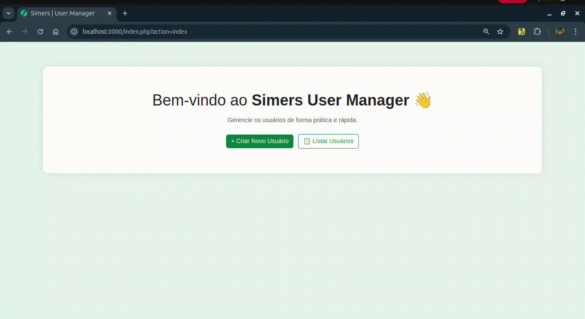
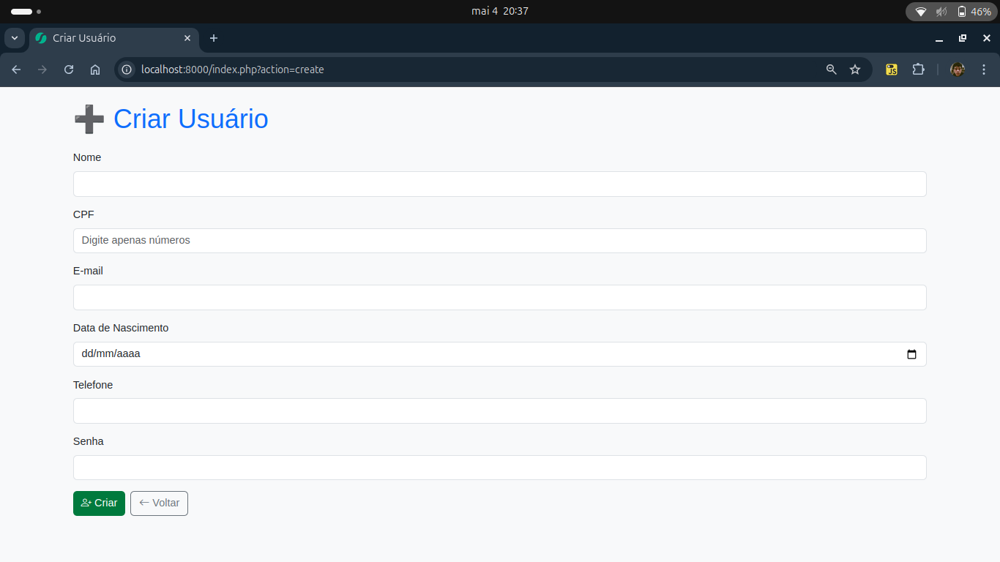
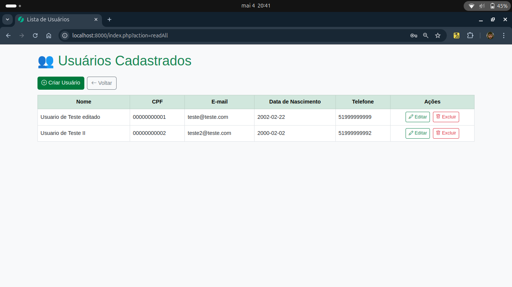
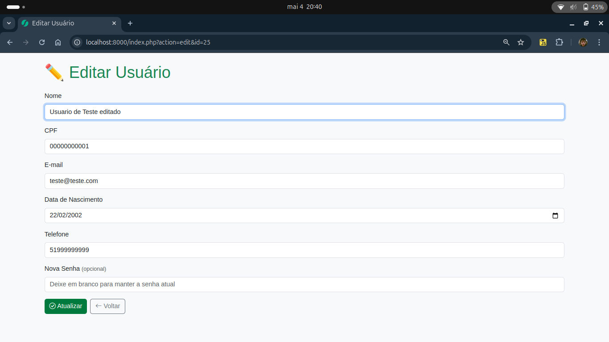
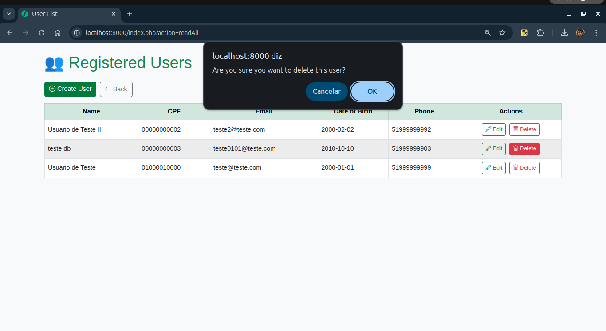
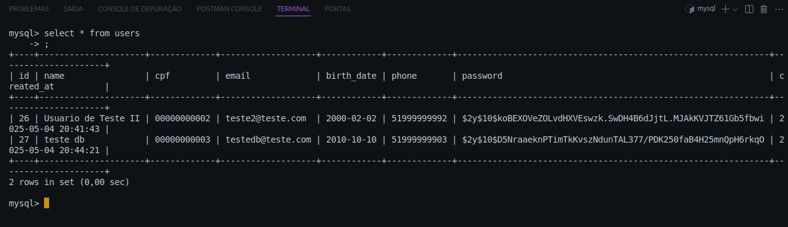

# Simers User Manager

Aplicação simples para cadastro, listagem, edição e exclusão de usuários.



---

## Funcionalidades Implementadas

### Criar Novo Usuário
Permite preencher os campos obrigatórios, validações são aplicadas, e a senha é criptografada.



---

### Listar Usuários
Mostra todos os usuários cadastrados em uma tabela. A senha não é exibida.



---

### Editar Usuário
Permite editar os campos do usuário. Se a senha for deixada em branco, ela permanece a mesma.



---

### Excluir Usuário
Botão de exclusão com confirmação.



### Criptografar Senha
Senha criptografada antes de ir para o banco de dados.



---

## Tecnologias Utilizadas

- PHP (sem framework)
- MySQL + PDO
- Bootstrap 5
- Arquitetura MVC
- HTML5 + CSS3

---

## Estrutura de Diretórios

```plaintext
/
├── src/
|  ├── app/
|  |  ├── controllers/
|  |  ├── core/
|  |  ├── models/
|  |  └── views/
|  ├── config/
|  |  ├── .env
|  |  └── config.php
|  ├── public/
|  |  ├── css/
|  |  └── index.php
|  ├── tests/
|  |  └── test_user.php
|  └── composer.json
├── .gitignore
└── README.md
```

---


## Como Rodar

1. Clone o projeto:
   ```bash
   git clone https://github.com/eduabdala/teste-tecnico-simers.git
   ```

2. Instale as dependências usando o Composer dentro do diretório `src`:
   ```bash
   cd src
   composer install
   ```

3. Crie o banco de dados MySQL com o nome `user_manager` e a tabela `users` com o comando:
   ```sql
   CREATE DATABASE user_manager;

   USE user_manager;

   CREATE TABLE users (
       id INT AUTO_INCREMENT PRIMARY KEY,
       name VARCHAR(100) NOT NULL,
       cpf VARCHAR(14) NOT NULL,
       email VARCHAR(100) NOT NULL,
       birth_date DATE NOT NULL,
       phone VARCHAR(20),
       password VARCHAR(255) NOT NULL,
       created_at TIMESTAMP DEFAULT CURRENT_TIMESTAMP
   );
   ```

4. Crie um arquivo `.env` dentro da pasta `src/config/` com o seguinte conteúdo:
   ```env
   DB_HOST=localhost
   DB_NAME=user_manager
   DB_USER=root
   DB_PASS=sua_senha
   ```

5. Rode o PHP localmente:
   ```bash
   php -S localhost:8000 -t src/public
   ```

6. Acesse no navegador: `http://localhost:8000`


---

## Requisitos

- PHP >= 8.0
- Composer
- MySQL

---

## Segurança

- Senhas criptografadas com `password_hash()`
- Validação de e-mail e campos obrigatórios
- Proteção contra XSS com `htmlspecialchars()`

---

## Autor

Eduardo Silva Abdala – [@eduabdala](https://github.com/eduabdala)